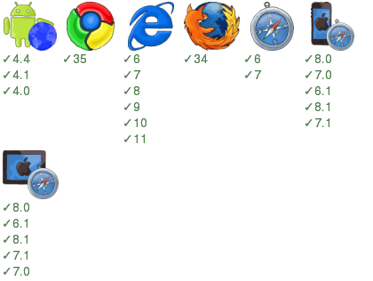

json-path-processor
===================

JsonPathProcessor (JPP) - A common data processor target to process data without running try catch hell, and get/set properties of nested objects.

[](https://www.npmjs.org/package/json-path-processor) [](https://david-dm.org/zordius/json-path-processor) [](https://travis-ci.org/zordius/json-path-processor) [](https://codeclimate.com/github/zordius/json-path-processor) [](https://codeclimate.com/github/zordius/json-path-processor) [](LICENSE.txt)

[](https://saucelabs.com/u/zordius_jpp)

Installation
------------

```sh
npm install json-path-processor
```

In browser:
```html
<script src="dist/jpp.js"></script>
```

In an AMD loader:
```javascript
require('jpp', function (jpp) {/*....*/});
```

In nodejs:
```javascript
var jpp =  require('json-path-processor');
```

Features
--------

* Chainning
* Iterate objects by simplified JSONPath
   * similar packages: <a href="https://www.npmjs.org/package/dotty">dotty</a> , <a href="https://www.npmjs.org/package/dot-access">dot-access</a> , <a href="https://www.npmjs.org/package/deep-get-set">deep-get-set</a> , <a href="https://www.npmjs.org/package/traverse">traverse</a>, <a href="https://www.npmjs.org/package/lodash-deep">lodash-deep</a>
* Catch all throwed error automatically

Upgrade Notice
--------------

* Now JPP stop using lodash and move to ES5. For none ES5 browsers/enviromnent, you should use polyfills to ensure JPP works well. You can try <a href="http://polyfill.io">polyfill.io</a> or <a href="http://polyfills.io/">polyfills.io/</a>.

* Some lodash like method behavior changed, please refer to document.

Usage
-----

```javascript
var jpp = require('json-path-processor');

// I wanna update all product title
data = jpp(data).each('product.title', function (V) {
    return something(V);
}).value();

// Ya, handle all product title and promotion description
// almost all jpp methods are chainable
data = jpp(data).each('extra.promotion', function (O) {
    O.description = someValue;
    return O;
}).each('product.title', someUtilFunc).value();

// jpp play on the object reference so you even do not need to assign back!
jpp(data).each('product', assignProductDefault);
jpp(data).each('product', changeProductDetail);
output(data);

// chaining is cool, right?
jpp(data)
.each('product', playTheProduct)
.each('product.title', fixProductTitle);
output(data);
```

API document and example
------------------------

* **jpp(data)** : create the JPP chainning object by data.

```javascript
var J = jpp(['any', 'data', {or: {recursive: {'object'}}}]);
```

* **jpp(data, path)** : a shortcut of jpp(data).value(path)

```javascript
console.log(jpp({a: {b: 'OK'}}, 'a.b')); // will get 'OK'
console.log(jpp({a: {b: 'OK'}}, 'a.c.d')); // will get undefined
```

* **.value(path)** : get value by JSON path. This method can not be chainned. When path is undefined or '' or '$', get whole data.

```javascript
console.log(jpp([1, 3, 5]).value()); // will get [1, 3, 5]
console.log(jpp({a: {b: 'OK'}}).value('a.b')); // will get 'OK'
console.log(jpp({a: {b: 'OK'}}).value('a.c.d')); // will get undefined
```

* **.get(path)** : get new JPP object by JSON path. All chainned methods on this is different from root object.

```javascript
console.log(jpp({a: {b: 'OK'}}).get('a').get('b').value()); // will get 'OK'
```

* **.set(path, value, create)** : set new value by JSON path. When value is a function, execute the function with first argument as old value. the return value of the callback function will be assigned. When create exists, create new object by the JSON path, and create will be used as default value to be assigned when the callback function throws exception.

```javascript
// will get {a: {b: 'OK', c:[1, 3]}}
console.log(jpp({a: {b: 'OK', c: [1, 4]}}).set('a.c.1', 3).value());

// will get {a: {b: 'BAD', c:[1, 4]}}
console.log(jpp({a: {b: 'OK', c: [1, 4]}}).set('a.b', 'BAD').value());

// will get {a: {b: 'OK', c:[1, 4]}}
console.log(jpp({a: {b: 'OK', c: [1, 4]}}).set('a.b.c.d', 'OK?').value());

// set failed ... WE CAN NOT CONVERT ARRAY TO OBJECT
console.log(jpp({a: {b: 'OK', c: [1, 4]}}).set('a.b.c.d', 'OK?', true).value());

// a.b.c[2 ~ 9] will become undefined ... ARRAY SIZE AUTO EXPEND IN JAVASCRIPT
console.log(jpp({a: {b: 'OK', c: [1, 4]}}).set('a.c.10', 'OK?', true).value());
```

* **.copy(from, to, skip)** : copy value from one JSON path to another. When the JSON path not found, new object will be created. To prevent new object creation, pass skip as true as 3rd param.

```javascript
// will get {a: {b: 'OK', c:[1, 4], d: 4}}
console.log(jpp({a: {b: 'OK', c: [1, 4]}}).copy('a.c.1', 'a.d').value());
```

* **.del(path)** : delete a key by JSON path. When the path exists, last key will be deleted; when it do not exist, do nothing.

```javascript
// will get {a: {b: 'OK', c: [1, 4]}}
console.log(jpp({a: {b: 'OK', c: [1, 4]}}).del('a.b.c').value());

// will get {a: {b: {}}
console.log(jpp({a: {b: {c: {d: 2, q: 1}}}}).del('a.b.c').value());
```

* **.move(from, to)** : move values from a path to another. when the origin path not found, do nothing.

```javascript
// will get {a: {b: 'OK', d: [1, 4]}}
console.log(jpp({a: {b: 'OK', c: [1, 4]}}).move('a.c', 'a.d').value());
```

* **.range(path, args...)** : Work like `lodash.range()` , create range and set the array into the path.

```javascript
// will get {a: {b: 1, c: [0, 1, 2]}}
console.log(jpp({a: {b: 1}}}).range('a.c', 3).value());

// will get {a: {b: 1, c: [3, 4]}}
console.log(jpp({a: {b: 1}}}).range('a.c', 3, 5).value());

// will get {a: {b: 1, c: [2, 5, 8, 11]}}
console.log(jpp({a: {b: 1}}}).range('a.c', 2, 12, 3).value());
```


* **.find(path, args...)** : JPP wraped version of `lodash.find()` , return the value. This method can not be chainned.

```javascript
// will get 3
console.log(jpp({a: {b: [0, 3, 4]}}}).find('a.b', function (O) {return O%2 > 0}));
```

* **.findLast(path, args...)** : JPP wraped version of `lodash.findLast()` , return the value. This method can not be chainned.

```javascript
// will get 5
console.log(jpp({a: {b: [1, 3, 4, 5]}}}).find('a.b', function (O) {return O%2 > 0}));
```

* **.each(path, function (value, key) {...})** : Works like Array.map(), the callback arguments are: value, index. The return value of callback will be assigned back to JPP object. You can apply second callback function for fallback when the path is not found or not array. When your callback return undefined or throws, the item in array will not be changed.

```javascript
console.log(jpp({a: {b: [1, 3, 5]}}).each('a.b', function (V) {
    return V * 2;
}).value());  // will get {a: {b: [2, 6, 10]}}

console.log(jpp({a: {b: [1, 3, 5]}}).each('a.b', function (V, I) { // I as index
    return V * I;
}).value());  // will get {a: {b: [0 , 3, 10]}}

// fallback when a.c is not array or not object or not found
console.log(jpp({a: {b: [1, 3, 5]}}).each('a.c', function (V) {
    return V * I;
}, function (O) {
    return 'ERROR'
}).value());  // will get {a: {b: [1 , 3, 5], c: 'ERROR'}}
```

* **.forIn(path, function (value, key) {...})** : Works like for (I in O), the callback arguments are: value, key. The return value of callback will be assigned back to JPP object. You can apply second callback function for fallback when the path is not found or not object. When your callback return undefined or throws, the item in object will not be changed.

```javascript
// will get {a: 'OK!', b: 'BAD!', length: '9!'} 
// forIn() will not think object with length property as array.
console.log(jpp({a: 'OK', b: 'BAD', length: 9}).forIn('$', function (V, I) {
    return V + '!';
}).value()); 

// fallback when a.c is not array or not object or not found
console.log(jpp({a: {b: [1, 3, 5]}}).forIn('a.c', function (V) {
    return V * I;
}, function (O) {
    return 'ERROR'
}).value());  // will get {a: {b: [1, 3, 5], c: 'ERROR'}}
```

* **.filter(path, function (value, key) {...})** : Works like Array.filter() but also works well on object. the callback are: value, index|key. The filtered result will be assigned back to JPP object.

```javascript
// will get {a: {b: {c: [3, 5], d:5}}}
console.log(jpp({a: {b: {c: [2, 3, 4, 5], d: 5}}}).filter('a.b.c', function (V) {
    return V % 2 > 0;
}).value()); 
```

* **.concat(path, path, path ...)** : search for all values by proviced JSON path, then concat all arraies into one. None array value will be skipped. When array size >= 1, assign the concated array back to first path. Or, do nothing.

```javascript
// will get {a: {b: {c: [1, 3], d:5}, d: [1, 3, 1,3]}}
console.log(jpp({a: {b: {c: [1, 3], d: 5}}}).concat('a.d', 'a.b.c', 'a.b.c').value());
```

Supported JSON Path
-------------------

We only support absolute JSON Path and receive only one item.

* $ : refer to self
* $.foo.bar : refer to foo then bar key
* $.foo.3.bar : refer to foo then 4th array item then bar key

The long story
--------------

All our life is to handle data....with a loop. Let's start from a basic loop:

```javascript
for (I in data) {
    data[I] = something(data[I]);
}
```

To make jslint happy or ensure the loop correct, we should add property check:

```javascript
for (I in data) {
    if (data.hasOwnProperty(I)) {
        data[I] = something(data[I]);
    }
}
```

In real life, data is not always ready. We must handle none data case:

```javascript
if (data && is_object(data)) {
    for (I in data) {
        if (data.hasOwnProperty(I)) {
            data[I] = something(data[I]);
        }
    }
}
```

Furthermore, please catch something() because they may throw some error.

```javascript
if (data && is_object(data)) {
    for (I in data) {
        if (data.hasOwnProperty(I)) {
            try {
                data[I] = something(data[I]);
            } catch (E) {
                handle_error(E);
            }
        }
    }
}
```

The more assign in the loop, the more try/catch you need.

```javascript
if (data && is_object(data)) {
    for (I in data) {
        if (data.hasOwnProperty(I)) {
            try {
                data[I].title = something(data[I].title);
            } catch (E) {
                handle_error(E);
            }
            try {
                data[I].desciption = something(data[I].description);
            } catch (E) {
                handle_error(E);
            }
            try {
                data[I].url = something(data[I].url);
            } catch (E) {
                handle_error(E);
            }
        }
    }
}
```

The loop becomes a nightmare now, right? Let's use lodash to reduce indents in the loop:

```javascript
_(data).each(function(V) {
    try {
        V.title = something(V.title);
    } catch (E) {
        handle_error(E);
    }
    try {
        V.desciption = something(V.description);
    } catch (E) {
        handle_error(E);
    }
    try {
        V.url = something(V.url);
    } catch (E) {
        handle_error(E);
    }
});

```

But, lodash still can not reduce the try/catch hell for you. Now, JsonPathProcessor help on this!
